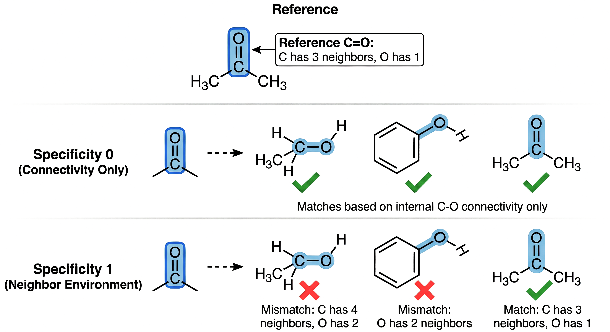

# FragmentFinder


A standalone Python tool for **interactive 3D identification** and **search of common molecular fragments** across a dataset using graph isomorphism algorithms.

## Overview

`FragmentFinder` solves a common problem in computational chemistry and cheminformatics: identifying the same functional group or substructure across a series of different molecules, even when atom indices differ.

It combines **interactive 3D selection** (using `vedo`) with **rigorous topological matching** (using `networkx`) to ensure that the atoms you analyze are exactly the ones you intend.

## Key Features

*   **Interactive 3D Selection**: Visually select atoms from a reference molecule. No need to look up atom indices manually.
*   **Smart Connectivity**: Robust chemical connectivity detection based on natural cutoffs and valence enforcement.
*   **Graph Isomorphism Matching**: Uses graph theory to find topologically identical fragments in other molecules, independent of atom ordering.
*   **Neighbor Environment Specificity**: Control how strict the matching should be regarding the environment.
*   **Atom Mapping**: Returns the exact indices of the matching atoms in each target molecule.

## Methodology

### 1. Smart Connectivity Algorithm
Unlike simple tools that use a fixed distance cutoff, FragmentFinder extracts connectivity using a two-phase strategy designed to handle both organic and organometallic species correctly:
1.  **Broad Detection Phase**: It first detects all *potential* bonds using a generous distance threshold (based on covalent radii $\times$ 1.25). This ensures even elongated bonds (e.g., in Transition States) are captured.
2.  **Valence Pruning Phase**: To prevent tangled networks of bonds, it enforces maximum valence constraints (e.g., C=4, H=1, O=2). If an atom exceeds its max valence, the algorithm retains the shortest bonds and prunes the excess.

### 2. Specificity Levels
You can control the strictness of the search using two levels:

*   **'0' - Connectivity Only**:
    *   The match is based solely on the fragment's graph (chemical symbols and internal connectivity).
    *   *Behavior*: If you select a `C-O` group, it will find matches in any molecule containing a carbon bonded to an oxygen, regardless of what else is attached to them.
    *   *Example*: A search for C=O (from a ketone) will match:
        *   **Ketone**: (Has C=O) ✅
        *   **Ethanol**: (Has C-O) ✅
        *   **Phenol**: (Has C-O) ✅

*   **'1' - Neighbor Environment**:
    *   Matches rely on the fragment's graph **AND** the neighbor count of each atom in the fragment (an atomic valence condition).
    *   *Behavior*: It enforces that each matched atom must have the exact same number of bonded neighbors as in the reference fragment.
    *   *Example*: If you select the C=O group from a **Ketone** (where C has 3 neighbors and O has 1 neighbor):
        *   **Ketone**: Matches. (C has 3 neighbors, O has 1) ✅
        *   **Ethanol**: No Match. (C has 4 neighbors [2H + 1C + 1O], O has 2 neighbors [1C + 1H]) ❌
        *   **Phenol**: No Match. (O has 2 neighbors [1C + 1H]) ❌



## Installation

### Option 1: Conda Environment (Recommended)

```bash
git clone https://github.com/1JELC1/FragmentFinder.git
cd FragmentFinder
conda env create -f environment.yml
conda activate fragment-finder
```

### Option 2: Manual Installation

Requirements: `python 3.9+`
```bash
pip install -r requirements.txt
```

## Usage

### Interactive Controls
The 3D viewer supports the following shortcuts:

| Key | Action |
| :--- | :--- |
| **Left Click** | Toggle selection of an atom (turns pink). |
| **n** | Select all **neighbors** of the currently selected atoms. |
| **e** | Toggle element/index **labels**. |
| **m** | **Clear** the current selection. |
| **q** | **Confirm** selection and proceed / Exit window. |

### Running the Tool
```bash
python FragmentFinder.py
```
1.  **Enter Path**: Provide the path to a reference `.xyz` file.
2.  **Select Fragment**: Use the 3D window to define your query fragment.
3.  **Refine Interest**: Select specific atoms *within* that fragment for targeted analysis.
4.  **Results**: The script searches for this fragment in all other `.xyz` files in the directory and extracts information for the selected atoms of interest.

### Output & Reports

The tool provides detailed feedback in the console and generates a CSV report:

1.  **Console Output**:
    *   Lists which files contain the fragment.
    *   **Multiple Matches**: Warns if a molecule contains the fragment more than once.
    *   **Atom Indices**: Prints the specific 1-based indices of the found atoms.
    *   **Neighbor Lists**: Displays the atoms directly connected to your fragment for verification.

2.  **CSV Report** (`fragment_counts.csv`):
    *   A summary file listing every molecule in the directory and the **count** of fragment occurrences found.
    *   Useful for quickly identifying outliers or molecules where the fragment is missing.

## Contributing

Contributions, issues, and feature requests are welcome!
Feel free to check the [issues page](https://github.com/1JELC1/FragmentFinder/issues) if you want to report a bug or request a feature.

## License

This project is licensed under the Apache License 2.0 - see the [LICENSE](LICENSE) file for details.

## Citation

If you use this software, please cite it using the metadata in [CITATION.cff](CITATION.cff).
